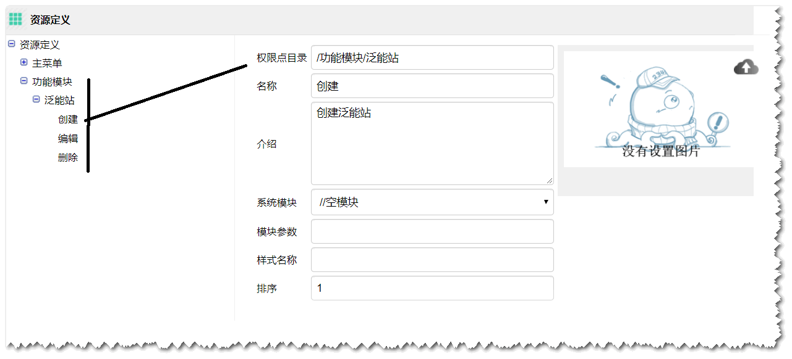

## WEB-FRAME 框架


# 关于按钮权限问题的处理

- 在菜单资源定义界面，定义各个按钮权限点，比如:
   
  
  
- ClientContext中增加用户对权限点的授权信息

```java
 public void setResources(List<S_RESOURCEObj> resources) {
        this.resources = resources;
    }

    List<S_RESOURCEObj> resources;

    /**
     * 用户是否对资源 resID拥有权限
     *
     * @param resId
     * @return
     */
    public boolean isAuthorized(Long resId) {
        Boolean authorized = false;
        if (resources != null && resId != null) {
            for (S_RESOURCEObj r : resources) {
                if (r.getId().equals(resId)) {
                    authorized = true;
                    break;
                }
            }
        }
        return authorized;
    }

    /**
     * 用户是否对资源 resID拥有权限
     *
     * @param path
     * @param funcPoint
     * @return
     */
    public boolean isAuthorized(String path, String funcPoint) {
        Boolean authorized = false;
        if (resources != null && path != null && funcPoint != null) {
            for (S_RESOURCEObj r : resources) {
                if (path.equals(r.getPath()) && funcPoint.equals(r.getName())) {
                    authorized = true;
                    break;
                }
            }
        }
        return authorized;
    }
```

- Login模块中 adminLogin 和 checkUserToken方法返回值 中增加用户的授权信息
       AdminLoginResponse.java 中增加
```java

    /**
     * 授权的资源。
     */
    public List<S_RESOURCEObj> authorities;
    
```
- AdminService中关于登录和findUserByToken中方法中 从数据库查询用户拥有的功能点，和查询用户拥有的菜单一样。

```java
 /**
     * 处理登录成功后返回的客户端配置信息
     *
     * @param resRootId
     * @param response
     */
    public void processLoginResult(Integer resRootId, AdminLoginResponse response) {

         ...

        //处理权限  resRootId 是项目中刚才定义的功能点的根资源 ID
        if ((resRootId != null) && (response.user != null)) {
            response.authorities = userMainMenu(response.user.getId(), resRootId);
        }
    }
```  

-  在各个模块中 从 ClientContext.isAuthorized方法验证用户是否拥有权限，隐藏按钮 或者禁用按钮

